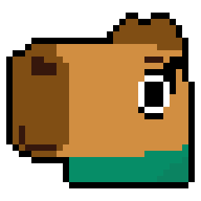

  

<h1 align="center">Capy na Batatinha</h1>

Batatinha frita, 1, 2, 3… com capivaras, empurrões e tropeços!

<strong>Offline com NPCs · Multiplayer por IP para até 8 humanos</strong>

Um jogo 2D inspirado na brincadeira de sinal verde e sinal vermelho de Round 6.
Chegue ao final antes que o tempo acabe, pare quando a boneca olhar e dispute
espaço com outras capivaras. Os NPCs tomam suas próprias decisões.

## Downloads

**A primeira prévia multiplayer está em preparação.** A release está sendo
organizada em rascunho e ainda não foi publicada.

### [Acessar as Releases](https://github.com/CapyRyanMUs/SquidCapy/releases)

| Plataforma | Pacote da prévia | Instalação |
| --- | --- | --- |
| Windows x64 | `CapyMultiplayerWindows.zip` | Extraia o ZIP e abra `CapyMultiplayer.exe`. |
| Android arm64 | `CapyMultiplayerAndroid.apk` | Baixe e instale o APK no aparelho. |

Os pacotes são **builds de depuração para testes**, não uma versão final ou
uma publicação em loja. O repositório é privado: após a publicação, os downloads
exigirão uma conta com acesso a ele. Rascunhos têm acesso ainda mais restrito.

No Windows, mantenha o EXE e o arquivo PCK na mesma pasta; não execute de dentro
do ZIP. No Android, o sistema pode pedir autorização para instalar aplicativos
pela fonte usada no download. Não é necessário instalar a Godot para jogar.

**A validação em um Android real ainda está pendente**, incluindo controles,
áudio e desempenho. Veja o [registro de testes](tests/VALIDATION.md).

## Começar a jogar

1. Abra o jogo e escolha sua aparência.
2. Para jogar sozinho, selecione a quantidade de NPCs e escolha **Offline**.
3. Para jogar com amigos, escolha **Hospedar** ou **Entrar por IP**.

O offline funciona sem conexão. É possível escolher **0, 1, 40, 60 ou 80 NPCs**;
o padrão é 40. No multiplayer, eles são adicionais aos humanos.

## Controles

| Ação | Windows |
| --- | --- |
| Mover | Setas |
| Correr | Shift |
| Empurrar | Espaço |
| Levantar após cair | Pressionar Ctrl repetidamente |

No Android, use os controles de toque para as mesmas ações.

A rodada dura **75 segundos**. Correr pode causar tropeços, e humanos e NPCs
podem empurrar uns aos outros. O sinal vermelho tem tolerância de 0,7 segundo;
depois disso, deslocar-se pode provocar eliminação, inclusive após um empurrão.

No offline, o resultado permite repetir a partida. No multiplayer, quem morre
ou chega ao final passa a assistir aos humanos ainda ativos e pode alternar a
câmera. A rodada termina quando todos os humanos têm resultado ou o tempo acaba.

## Jogar com amigos

Todos devem usar a **mesma versão do jogo**. Windows e Android foram preparados
para participar da mesma sala; a validação conjunta em aparelho real está pendente.

### Na mesma rede Wi-Fi ou LAN

1. O anfitrião escolhe **Hospedar**, usando a porta padrão **7000/UDP** ou outra
   porta disponível. A sala mostra os IPs locais da máquina.
2. Os amigos escolhem **Entrar por IP**, informam o IP local do anfitrião e a
   mesma porta.
3. Todos marcam **Pronto**; o anfitrião inicia a partida.

Permita a comunicação do jogo no firewall. Redes de convidados e isolamento
entre dispositivos no Wi-Fi podem impedir a conexão. Não é necessária VPN
quando os aparelhos conseguem se comunicar diretamente na mesma rede.

### Pela internet

O anfitrião precisa estar acessível: a conexão direta usa o IP público e pode
exigir encaminhamento da porta UDP no roteador. Com **CGNAT**, encaminhar a
porta somente no roteador de casa geralmente não é suficiente.

Uma alternativa é uma VPN de rede virtual compatível com os dispositivos de
todos: conectem-se à mesma rede virtual e usem o IP que ela atribuir ao anfitrião.
A VPN é externa ao jogo; essa configuração ainda precisa ser testada na rede
e nos aparelhos utilizados.

**O GitHub hospeda os downloads, não as partidas.** Não há relay integrado,
matchmaking ou salas por código. A conexão continua dependendo da rede do anfitrião.

### Fim da partida e desconexões

- O anfitrião pode retornar todos à sala para outra rodada.
- Quem desconecta abandona a disputa e não é substituído por NPC.
- Se o anfitrião sair, a sala termina e todos retornam ao menu.
- Não há reconexão, migração de anfitrião ou entrada após o início do carregamento.
- O HUD avisa quando o ping passa de 200 ms; conexões lentas podem apresentar correções de movimento.

## Encontrou um problema?

Envie o relato em [Issues](https://github.com/CapyRyanMUs/SquidCapy/issues), com:

- Versão ou nome da release e plataforma; no Android, modelo do aparelho.
- Modo offline ou multiplayer e quem estava hospedando.
- Passos para reproduzir, resultado esperado e o que aconteceu.
- Mensagem de erro e, se possível, imagem ou vídeo.

## Desenvolvimento e testes

Feito em **Godot 4.7.2 stable**. Para abrir o projeto, executar os testes,
entender a arquitetura e exportar os pacotes, consulte:

- [Guia de desenvolvimento](docs/DESENVOLVIMENTO.md).
- [Resultados e roteiro de validação](tests/VALIDATION.md).
- [Notas da Prévia Multiplayer 1](docs/releases/multiplayer-preview-1.md).
